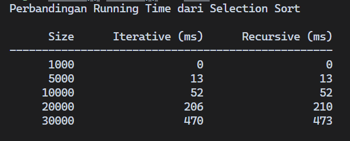

# Tugas Besar Analisis Kompleksitas Algoritma

- Semester ganjil 2024/2025
- Kelas IF-47-02 PJJ
- Kelompok 10:
  - Abdul Malik (103042310065)
  - Ana Zulfia (103042310080)

## Deskripsi
Program dibuat untuk menampilkan hasil pengujian algoritma dengan penulisan secara Iteratif dan Rekursif. Tipe algoritma pengurutan yang digunakan adalah *Selection Sort*.

## Penerapan Kode
Penerapan kode yang digunakan adalah bahasa C++, implementasinya ada di file [sort.cpp](sort.cpp).
```cpp
void swap(int &a, int &b) {
    a = a + b;
    b = a - b;
    a = a - b;
}

// Iteratif
void selectionSortIterative(int arr[], int n) {
    for (int i = 0; i < n - 1; i++) {
        int minIndex = i;
        for (int j = i + 1; j < n; j++) {
            if (arr[j] < arr[minIndex]) {
                minIndex = j;
            }
        }
        swap(arr[i], arr[minIndex]);
    }
}

// Rekursif
void selectionSortRecursive(int arr[], int n) {
    if (n == 1) {
        return;
    }
    int minIndex = 0;
    for (int i = 1; i < n; i++) {
        if (arr[i] < arr[minIndex]) {
            minIndex = i;
        }
    }
    swap(arr[0], arr[minIndex]);
    selectionSortRecursive(arr + 1, n - 1);
}
```

## Cara Menjalankan Program
Untuk menjalankan program, jalankan perintah berikut pada terminal:

```bash
$ bash run.sh
```
Atau:
```bash
$ chmod +x run.sh
$ ./run.sh
```

## Hasil
Setelah program dijalankan, maka hasilnya kira-kira akan ditampilkan seperti berikut:



***Note**: Setiap dijalankan mungkin akan menghasilkan hasil yang berbeda, karena bergantung pada kondisi sistem, data input, CPU scheduling, cache memory, dan lain-lain.*